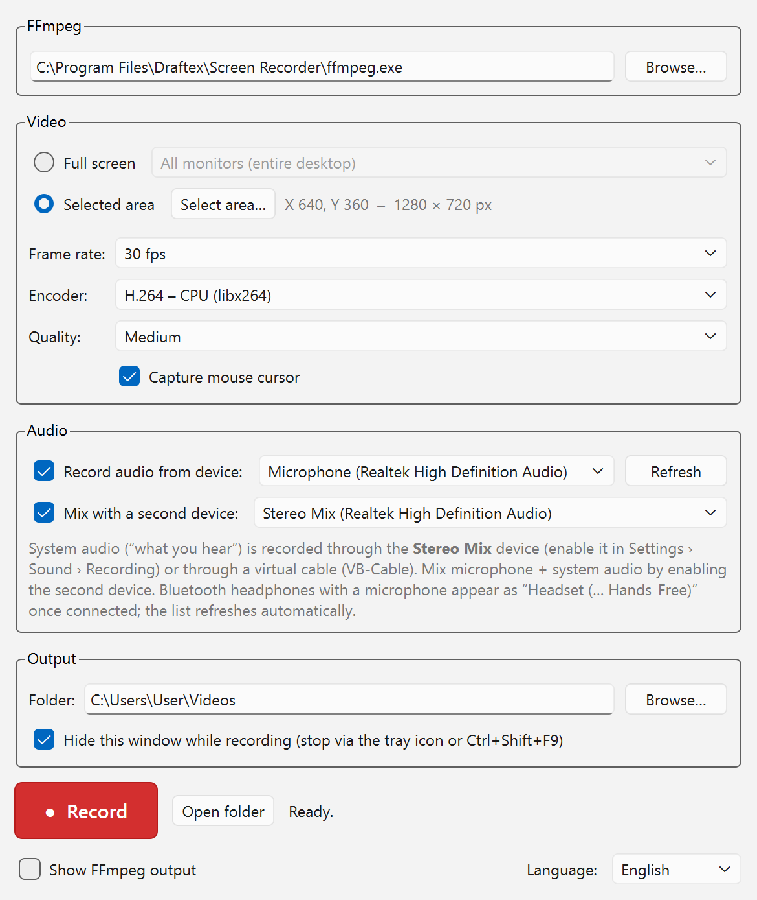

# Draftex Screen Recorder

Free screen recorder for Windows 10 and 11. Records the whole desktop, a single
monitor or a selected area into MP4, including audio from any Windows recording
device. Unlike the Xbox Game Bar it captures everything on screen: context menus,
tooltips, popup windows and dialogs of other applications.

Written in Python with PyQt6, using `ffmpeg.exe` as a separate process for
capture and encoding.

*Slovenská verzia tohto súboru: [README.sk.md](README.sk.md)*



## Download

Ready-to-use, code-signed installer:

- [GitHub Releases](../../releases/latest)
- [draftex.sk](https://draftex.sk/programovanie.html#screen-recorder)

The installer needs no administrator rights. It installs into
`%LocalAppData%\Programs\Draftex\Screen Recorder` and the dialog also offers a
machine-wide installation into Program Files.

## Features

- Capture the entire desktop, one monitor, or a freely selected area
- The selected area keeps a visible frame you can resize by dragging its edges
  or corners; the frame sits just outside the capture, so it never appears in
  the video
- Audio from any DirectShow recording device: microphones, line-in, Stereo Mix,
  Bluetooth headsets, virtual cables
- Mix two audio devices at once, for example a microphone plus system sound
- H.264 encoding on the CPU (libx264) or on the GPU (NVENC, AMF, QSV)
- Global hotkey `Ctrl+Shift+F9` starts and stops recording even when the window
  is hidden
- Runs in the tray, optional start with Windows via `--tray`
- Slovak and English user interface

## System audio

FFmpeg records through DirectShow, so it offers the devices Windows registers as
recording devices. To capture system audio ("what you hear"), enable **Stereo
Mix** in Settings › Sound › Recording if your driver provides it, or install a
virtual cable such as VB-Cable and set it as the output device. The second
device selector then lets you mix microphone and system audio into one track.

Bluetooth headphones with a microphone appear as `Headset (… Hands-Free)` once
connected. The device list refreshes automatically when hardware is connected or
removed. Note that the Hands-Free profile switches the headphones to mono at a
low sample rate, which is a Windows limitation, not one of this application.

## Running from source

```
pip install -r requirements.txt
pythonw screen_recorder.py
```

`ffmpeg.exe` has to be in `PATH`, next to the script, or in an `ffmpeg`
subdirectory. The path can also be set in the application window.

```
winget install Gyan.FFmpeg
```

Start with `--tray` to launch into the tray only, which is what the autostart
entry uses.

## Building the installer

Requirements on the build machine:

1. Python 3.11 (64-bit)
2. [Inno Setup 6.3+](https://jrsoftware.org/isdl.php), optional; without it only
   the portable build in `dist\` is produced
3. Internet access for the first FFmpeg download, or your own `ffmpeg.exe`
   copied into the `ffmpeg\` directory

Then run:

```
build.bat
```

Results:

- `installer\DraftexScreenRecorder-Setup-<version>.exe`
- `dist\DraftexScreenRecorder\` portable build, just copy it and run the exe

### Code signing

Signing is optional. Put `signtool` on `PATH` and set `SIGN_CMD` before running
the build. The path must not be quoted inside `SIGN_CMD`, otherwise `cmd`
breaks it when passing it to the Inno Setup compiler.

```
set "PATH=C:\Program Files (x86)\Windows Kits\10\bin\10.0.26100.0\x64;%PATH%"
set SIGN_CMD=signtool sign /sha1 <certificate thumbprint> /fd sha256 /tr http://ts.ssl.com /td sha256
```

`build.bat` then signs the application executable, the installer and the
uninstaller. Without `SIGN_CMD` the build is simply unsigned.

### New version

Change the number in three places: `APP_VERSION` in `screen_recorder.py`, the
four fields in `version_info.txt`, and `MyAppVersion` in `installer.iss`.

## Translations

Slovak is the source language, English is the `TR_EN` dictionary in
`screen_recorder.py` used through the `tr()` function. The language is taken
from the `language` value in the registry, written either by the installer or by
the language selector in the window, and otherwise from the Windows locale.
When you add a new string to the interface, wrap it in `tr("…")` and add its
translation to `TR_EN`.

## License

GNU General Public License version 3, see [LICENSE](LICENSE).

Version 3 only, without the usual "or later" clause, because PyQt6 is licensed
as GPL-3.0-only.

### Third-party components

| Component | License | Note |
|---|---|---|
| PyQt6 | GPL-3.0-only | imported directly by the application |
| Qt 6 | LGPL-3.0 | via PyQt6 |
| PyQt6-sip | BSD-2-Clause | via PyQt6 |
| FFmpeg | GPL | separate process, not linked into the application |

The distributed package includes FFmpeg ([ffmpeg.org](https://ffmpeg.org)) as a
standalone `ffmpeg.exe` built by [BtbN](https://github.com/BtbN/FFmpeg-Builds),
together with its license file. Its sources are published with every build by
that project. An LGPL-only FFmpeg build can be used instead, but it has no
libx264, leaving only the hardware encoders.
