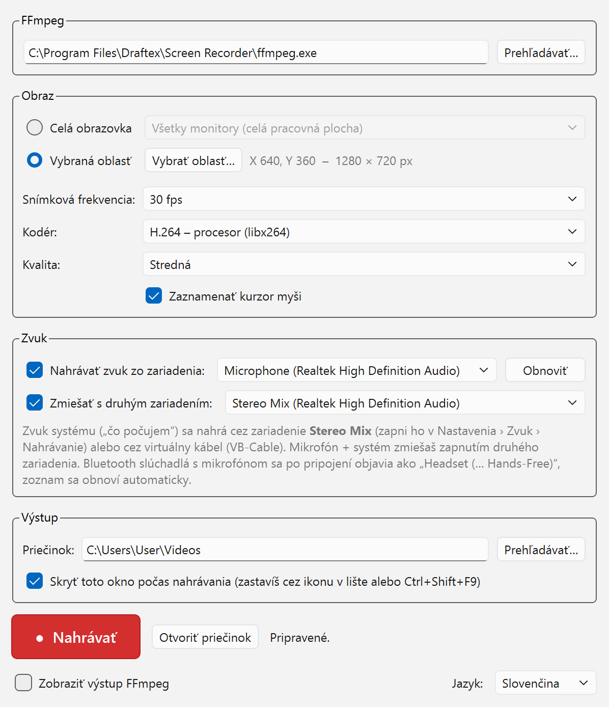

# Draftex Screen Recorder

Nahrávanie obrazovky zadarmo pre Windows 10 a 11. Zaznamená celú plochu, jeden
monitor alebo vybranú oblasť do MP4 vrátane zvuku z ľubovoľného nahrávacieho
zariadenia Windows. Na rozdiel od Xbox Game Bar zachytí všetko, čo je na
obrazovke: kontextové menu, tooltipy, popup okná aj dialógy iných aplikácií.

Napísané v Pythone s PyQt6, na zachytávanie a kódovanie volá `ffmpeg.exe` ako
samostatný proces.

*English version of this file: [README.md](README.md)*



## Stiahnutie

Hotový podpísaný inštalátor:

- [GitHub Releases](../../releases/latest)
- [draftex.sk](https://draftex.sk/programovanie.html#screen-recorder)

Inštalátor nepotrebuje práva správcu, inštaluje do
`%LocalAppData%\Programs\Draftex\Screen Recorder`. Dialóg ponúkne aj inštaláciu
pre všetkých používateľov do Program Files.

## Čo vie

- Nahrá celú plochu, jeden monitor alebo voľne vybranú oblasť
- Vybraná oblasť má trvalo viditeľný rám, ktorého steny sa dajú ťahať za hranu
  alebo roh; rám je nakreslený tesne mimo záberu, takže sa do videa nedostane
- Zvuk z ľubovoľného DirectShow zariadenia: mikrofóny, line-in, Stereo Mix,
  Bluetooth headsety, virtuálne káble
- Zmiešanie dvoch zariadení naraz, napríklad mikrofón a zvuk systému
- Kódovanie H.264 procesorom (libx264) alebo grafikou (NVENC, AMF, QSV)
- Globálna skratka `Ctrl+Shift+F9` spustí a zastaví nahrávanie aj pri skrytom okne
- Beží v lište, voliteľne sa spúšťa s Windows cez `--tray`
- Slovenské a anglické rozhranie

## Zvuk systému

FFmpeg nahráva cez DirectShow, takže ponúka zariadenia, ktoré Windows eviduje
ako nahrávacie. Na zachytenie zvuku systému („čo počujem“) zapni v Nastavenia ›
Zvuk › Nahrávanie zariadenie **Stereo Mix**, ak ho ovládač ponúka, alebo
nainštaluj virtuálny kábel (napríklad VB-Cable) a nastav ho ako výstup. Druhý
prepínač zariadenia potom zmieša mikrofón a zvuk systému do jednej stopy.

Bluetooth slúchadlá s mikrofónom sa po pripojení objavia ako
`Headset (… Hands-Free)`. Zoznam zariadení sa obnoví automaticky pri pripojení
alebo odpojení hardvéru. Profil Hands-Free prepne slúchadlá do mono s nízkou
vzorkovacou frekvenciou, čo je obmedzenie Windows, nie tejto aplikácie.

## Spustenie zo zdrojáku

```
pip install -r requirements.txt
pythonw screen_recorder.py
```

`ffmpeg.exe` musí byť v `PATH`, vedľa skriptu alebo v podpriečinku `ffmpeg`.
Cestu sa dá zadať aj priamo v okne aplikácie.

```
winget install Gyan.FFmpeg
```

Prepínač `--tray` spustí aplikáciu len do lišty, tak ju spúšťa aj autoštart.

## Build inštalátora

| Súbor | Účel |
|---|---|
| `screen_recorder.py` | aplikácia (PyQt6, volá `ffmpeg.exe`) |
| `screen_recorder.spec` | PyInstaller konfigurácia (onedir, bez konzoly, ikona, version info) |
| `version_info.txt` | Windows „Podrobnosti“ súboru EXE (firma, verzia, popis) |
| `icon.ico` | ikona EXE a inštalátora |
| `installer.iss` | Inno Setup 6 skript (slovenčina + angličtina) |
| `build.bat` | celý build jedným spustením |
| `requirements.txt` | PyQt6 + PyInstaller |

Požiadavky na build PC:

1. Python 3.11 (64-bit)
2. [Inno Setup 6.3+](https://jrsoftware.org/isdl.php), voliteľné; bez neho vznikne
   len prenositeľná verzia v `dist\`
3. Internet na prvé stiahnutie FFmpeg, alebo vlastný `ffmpeg.exe` skopírovaný do
   priečinka `ffmpeg\`

Potom stačí:

```
build.bat
```

Výsledok:

- `installer\DraftexScreenRecorder-Setup-<verzia>.exe`
- `dist\DraftexScreenRecorder\` prenositeľná verzia, stačí skopírovať a spustiť

### Podpísanie

Podpis je voliteľný. Pridaj `signtool` do `PATH` a nastav `SIGN_CMD`. Cesta
v `SIGN_CMD` nesmie byť v úvodzovkách, `cmd` by ju pri odovzdaní do Inno Setup
rozbil.

```
set "PATH=C:\Program Files (x86)\Windows Kits\10\bin\10.0.26100.0\x64;%PATH%"
set SIGN_CMD=signtool sign /sha1 <odtlačok certifikátu> /fd sha256 /tr http://ts.ssl.com /td sha256
```

`build.bat` potom podpíše aplikáciu, inštalátor aj uninstaller. Bez `SIGN_CMD`
vznikne nepodpísaný build.

### Nová verzia

Zmeň číslo na troch miestach: `APP_VERSION` v `screen_recorder.py`, štyri polia
vo `version_info.txt` a `MyAppVersion` v `installer.iss`.

## Inštalátor

- inštaluje bez admin práv, dialóg ponúkne aj inštaláciu pre všetkých používateľov
- výber jazyka (slovenčina / angličtina) sa zobrazí vždy; zvolený jazyk sa zapíše
  do `HKCU\Software\Draftex\ScreenRecorder\language` a aplikácia ho prevezme
- voliteľná úloha „Spúšťať pri prihlásení“ spustí `DraftexScreenRecorder.exe --tray`
- pri odinštalovaní zmaže aj nastavenia v registri
- pri aktualizácii zatvorí bežiacu aplikáciu (`CloseApplications=yes`)

## Jazyk rozhrania

Zdrojový jazyk je slovenčina, angličtina je slovník `TR_EN` v
`screen_recorder.py` cez funkciu `tr()`. Jazyk sa určí z hodnoty `language`
v registri, ktorú zapíše inštalátor alebo prepínač v okne, inak podľa jazyka
Windows. Pri pridaní nového textu do rozhrania ho obal do `tr("…")` a doplň
preklad do `TR_EN`.

## Licencia

GNU General Public License verzia 3, pozri [LICENSE](LICENSE).

Verzia 3 bez obvyklého dodatku „or later“, pretože PyQt6 je licencované ako
GPL-3.0-only.

### Komponenty tretích strán

| Komponent | Licencia | Poznámka |
|---|---|---|
| PyQt6 | GPL-3.0-only | aplikácia ho priamo importuje |
| Qt 6 | LGPL-3.0 | cez PyQt6 |
| PyQt6-sip | BSD-2-Clause | cez PyQt6 |
| FFmpeg | GPL | samostatný proces, nie je linkovaný do aplikácie |

Distribuovaný balík obsahuje FFmpeg ([ffmpeg.org](https://ffmpeg.org)) ako
samostatný `ffmpeg.exe` z buildov [BtbN](https://github.com/BtbN/FFmpeg-Builds)
spolu s jeho licenčným súborom. Zdrojové kódy zverejňuje ten projekt pri každom
builde. Dá sa použiť aj LGPL-only build FFmpeg, ten však nemá libx264, ostanú len
hardvérové kodéry.
